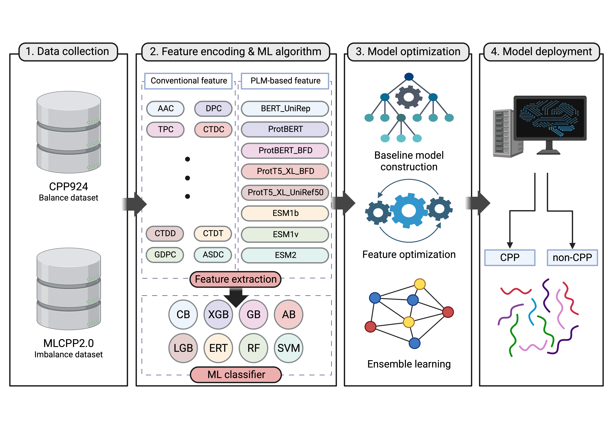

# CPPpred-En

CPPpred-En is an ensemble-based prediction model for identifying cell-penetrating peptides (CPPs), which are crucial for drug delivery and peptide-based therapeutics. Unlike previous methods that rely on either conventional features or a limited number of protein language models (PLMs), CPPpred-En combines 69 conventional features with 8 PLM-derived features across 8 machine learning classifiers. The final model, built using an ensemble strategy, demonstrates strong generalizability and achieves state-of-the-art performance with an accuracy of 97.27% (MCC 0.964) on balanced and 96.10% (MCC 0.707) on imbalanced datasets.


## Model workflow


## Installation Guide

This code requires Python 3. For simplicity, I recommend using Anaconda. If conda is not installed on your system, you can download it [here](https://docs.anaconda.com/miniconda/).

1. (Optional) Create a conda environment for this workshop and activate it:

```bash
conda create -n CPPpred-En python=3.9.20
source activate CPPpred-En
```

2. Install the environment:

```bash
pip install -r requirements.txt
```

## Dataset
All datasets are located in the [data folder](./data).
CPP924: Download Standalone Version of [CPP924](https://github.com/Excelsior511/StackCPPred)
MLCPP2.0: Download Standalone Version of [MLCPP2.0](https://balalab-skku.org/mlcpp2/download/)


## Usage

How to run the CPP924(balance) dataset using the pre-trained weights:

```bash
python balance_data_test.py
```

How to run the MLCPP2.0(imbalance) set using the pre-trained weights:

```bash
python imbalance_data_test.py
```

## Author

Yong Eun Jang, Minjun Kwon, Seok Gi Kim , Nimisha Pradeep George, Ji Su Hwang, Shaherin Basith , Gwang Lee
## Reference

To be added once the paper is published.